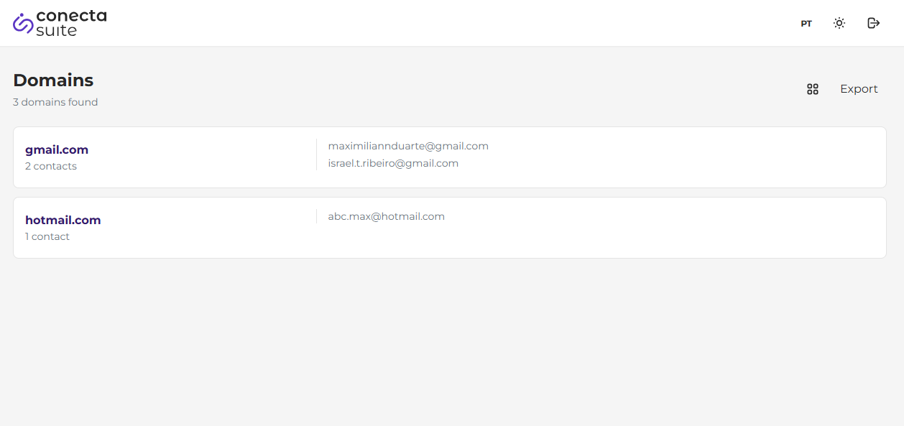

# Meus Contatos MS


Um sistema web para visualizar e organizar contatos de uma conta Microsoft, agrupando-os de forma inteligente por domínio de e-mail. Este projeto foi desenvolvido como um teste técnico para a **Conecta Suite**.



## Índice

- [Visão Geral](#visão-geral)
- [Core Features](#core-features)
- [Tech Stack](#tech-stack)
- [Pré-requisitos](#pré-requisitos)
- [Guia de Instalação](#guia-de-instalação)
  - [1. Clonar o Repositório](#1-clonar-o-repositório)
  - [2. Configurar a Aplicação no Azure](#2-configurar-a-aplicação-no-azure)
  - [3. Configurar o Backend (Flask)](#3-configurar-o-backend-flask)
  - [4. Configurar o Frontend (Vue.js)](#4-configurar-o-frontend-vuejs)
- [Como Rodar a Aplicação](#como-rodar-a-aplicação)
- [Funcionalidades e Uso](#funcionalidades-e-uso)
- [Decisões de Arquitetura](#decisões-de-arquitetura)
- [Deploy](#deploy)
- [Licença](#licença)

## Visão Geral

O projeto "Meus Contatos MS" permite que um usuário faça login de forma segura com sua conta Microsoft (via OAuth2). Após a autenticação, a aplicação consome a Microsoft Graph API para buscar os contatos do usuário, os agrupa por domínio e os exibe em uma interface moderna e interativa, inspirada na identidade visual da **Conecta Suite**.

## Core Features

- ✅ **Autenticação Segura:** Login com a Microsoft utilizando o fluxo OAuth2, com validação de `state` para prevenir ataques CSRF.
- 🌗 **Tema Dark/Light:** Interface com suporte a tema claro e escuro, com persistência e detecção automática da preferência do sistema.
- 📊 **Layouts Dinâmicos:** Alterne entre a visualização em grade (Grid) ou em lista (List) para organizar os domínios.
- 📤 **Exportação de Dados:** Exporte a lista completa de contatos para os formatos **CSV**, **JSON** e **Excel (.xlsx)**.
- 🔍 **Interação Avançada:** Navegue para uma visão detalhada por domínio, com busca em tempo real e ações rápidas para copiar ou enviar e-mails.
- 🌐 **Internacionalização (i18n):** Suporte completo para Português (pt-BR) e Inglês (en-US).
- ✨ **Transições Suaves:** Animações e telas de transição para login e logout, garantindo uma experiência de usuário fluida e sem interrupções.

## Tech Stack

#### Backend

- **Python 3.11+**
- **Flask:** Microframework para a criação da API REST.
- **MSAL (Microsoft Authentication Library) for Python:** Para gerenciar o fluxo de autenticação OAuth2.
- **Gunicorn:** WSGI server para produção.
- **Docker:** Para conteinerização da aplicação.

#### Frontend

- **Vue.js 3:** Framework reativo com a **Composition API**.
- **Vite:** Ferramenta de build e desenvolvimento de alta performance.
- **Pinia:** Gerenciamento de estado moderno para Vue.js.
- **Vue Router:** Para o roteamento de páginas.
- **Tailwind CSS:** Framework CSS utility-first para um design system customizável.
- **Axios:** Cliente HTTP para comunicação com o backend.
- **vue-i18n:** Para a internacionalização.
- **xlsx**: Biblioteca para a funcionalidade de exportação.

## Pré-requisitos

Antes de começar, garanta que você tenha as seguintes ferramentas instaladas:

- **Node.js:** `v20.x` ou superior.
- **npm:** `v10.x` ou superior (`npm` é instalado junto com o Node.js).
- **Python:** `v3.11` ou superior.
- **Git:** Para clonar o repositório.
- **Azure Account:** Para configurar a autenticação OAuth2.

## Guia de Instalação

Siga os passos abaixo para configurar o ambiente de desenvolvimento local.

### 1. Clonar o Repositório

```bash
git clone https://github.com/maxmilian02/meus-contatos-ms.git
cd meus-contatos-ms
```

### 2. Configurar a Aplicação no Azure

Para que a autenticação funcione, você precisa registrar a aplicação no portal do Azure:

1. Acesse o [Azure Portal](https://portal.azure.com/) e faça login.
2. Navegue até **Azure Active Directory** > **Registros de aplicativo**.
3. Clique em **Novo registro** e configure:
   * **Nome:** `Meus Contatos MS (Dev)`
   * **Tipos de conta com suporte:** *Contas em qualquer diretório organizacional (Qualquer diretório do Azure AD – Multilocatário) e contas Microsoft pessoais (por exemplo, Skype, Xbox)*.
   * **URI de Redirecionamento (Web):** `http://localhost:5000/auth/login/callback`
4. Após o registro, anote o **ID do Aplicativo (cliente)**.
5. No menu esquerdo, vá para **Certificados & segredos**, clique em **Novo segredo do cliente**, dê uma descrição e copie o **Valor** do segredo (não o ID).

### 3. Configurar o Backend (Flask)

```bash
# Navegue até a pasta do backend
cd backend

# Crie e ative um ambiente virtual
python -m venv venv
source venv/bin/activate  # No Windows: venv\Scripts\activate

# Instale as dependências
pip install -r requirements.txt
```

Crie um arquivo chamado `.env` na pasta `backend` com o seguinte conteúdo, substituindo pelos seus valores obtidos no Azure:

```env
# backend/.env
SECRET_KEY='gere_uma_chave_forte_aqui'
MS_CLIENT_ID='seu_id_de_cliente_do_azure'
MS_CLIENT_SECRET='seu_segredo_de_cliente_do_azure'

# URLs (geralmente não precisa mudar para dev local)
MS_REDIRECT_URI='http://localhost:5000/auth/login/callback'
FRONTEND_URL='http://localhost:5173'
```

> **Dica:** Para gerar uma `SECRET_KEY` forte, execute no terminal:
> `python -c "import secrets; print(secrets.token_hex(32))"`

### 4. Configurar o Frontend (Vue.js)

```bash
# Em um novo terminal, navegue até a pasta do frontend
cd frontend/vue-project

# Instale as dependências do npm
npm install
```

Crie um arquivo chamado `.env.local` na pasta `frontend/vue-project` para definir a URL da API:

```env
# frontend/vue-project/.env.local
VITE_API_URL=http://localhost:5000
```

## Como Rodar a Aplicação

Você precisará de dois terminais abertos.

1. **Terminal 1: Rodar o Backend**

   ```bash
   cd backend
   source venv/bin/activate
   flask run
   ```

   O servidor backend estará rodando em `http://localhost:5000`.
2. **Terminal 2: Rodar o Frontend**

   ```bash
   cd frontend/vue-project
   npm run dev
   ```

   A aplicação estará acessível em `http://localhost:5173`.

## Funcionalidades e Uso

1. **Login:** Acesse `http://localhost:5173`. Clique no botão "Fazer login com a Microsoft". Você será redirecionado para a tela de login da Microsoft.
2. **Autorização:** Após o login, a aplicação solicitará as permissões necessárias para ler seus contatos.
3. **Carregamento:** Você verá uma tela de carregamento enquanto seus dados são autenticados e seus contatos são buscados.
4. **Tela de Contatos:** Após o carregamento, você será levado à tela principal, onde seus contatos são exibidos, agrupados por domínio.
5. **Trocar Layout:** Use o botão de ícone de grade/lista para alternar a visualização.
6. **Explorar Domínio:** Clique em qualquer card de domínio para entrar na visão detalhada.
7. **Buscar e Interagir:** Na tela de detalhes, use a barra de busca para filtrar e-mails e use os botões de ação para copiar um endereço ou abrir seu cliente de e-mail.
8. **Exportar:** Volte para a tela principal e use o menu "Exportar" para baixar seus contatos nos formatos disponíveis.

## Decisões de Arquitetura

Este projeto foi construído com foco em escalabilidade, manutenibilidade e uma boa experiência de desenvolvimento.

- **Backend (Flask):**

  - **Padrão App Factory (`create_app`):** Permite criar múltiplas instâncias da aplicação com configurações diferentes, facilitando testes e deploys.
  - **Blueprints:** Organiza a aplicação em componentes modulares (`auth`, `contacts`), tornando o código mais limpo e fácil de manter.
- **Frontend (Vue.js):**

  - **Composition API:** Utilizada para organizar a lógica por funcionalidade, tornando os componentes mais legíveis e reutilizáveis.
  - **Pinia:** A lógica de estado, incluindo autenticação e dados de contatos, foi centralizada em stores, desacoplando os componentes da lógica de negócio.
  - **Composables (`useTheme`, `useExport`):** A lógica de tema e exportação foi extraída para `composables`, permitindo que seja reutilizada e testada de forma isolada, seguindo o princípio de *separação de concerns*.
  - **Roteamento Protegido:** O Vue Router utiliza `meta fields` e `navigation guards` para garantir que a rota `/contatos` só seja acessível por usuários autenticados.
  - **Tailwind CSS:** Adotado para criar um *design system* customizado e de rápida implementação. As classes base (`@apply`) foram usadas para criar componentes reutilizáveis como `.card`, evitando a repetição de código.

## Deploy

Para realizar o deploy em produção, siga os guias para Google Cloud Run e Firebase Hosting.

#### Backend (Google Cloud Run)

1. **Build da Imagem Docker:**
   ```bash
   # A partir da pasta /backend
   gcloud builds submit --tag gcr.io/SEU_ID_PROJETO/meus-contatos-backend
   ```
2. **Deploy no Cloud Run:**
   ```bash
   gcloud run deploy meus-contatos-backend \
     --image gcr.io/SEU_ID_PROJETO/meus-contatos-backend \
     --platform managed \
     --region sua-regiao \
     --allow-unauthenticated \
     --set-env-vars="MS_CLIENT_ID=SEU_ID,MS_CLIENT_SECRET=SEU_SEGREDO,SECRET_KEY=SUA_CHAVE,FRONTEND_URL=URL_DO_FRONTEND,MS_REDIRECT_URI=URL_DO_BACKEND/auth/login/callback"
   ```

#### Frontend (Firebase Hosting)

1. **Build de Produção:**
   ```bash
   # A partir da pasta /frontend/vue-project
   npm run build
   ```
2. **Deploy no Firebase:**
   ```bash
   # A partir da pasta raiz do projeto
   firebase deploy --only hosting
   ```

> **⚠️ Importante:**
>
> - Atualize o **URI de Redirecionamento** no Azure para a URL do seu serviço no Cloud Run.
> - No deploy do Cloud Run, defina a variável de ambiente `FRONTEND_URL` com a URL do seu Firebase Hosting.
> - Crie um arquivo `.env.production` no frontend com `VITE_API_URL` apontando para a URL do seu backend no Cloud Run.
> - Para que a autenticação cross-domain funcione, as configurações de cookie no `backend/config.py` (`SAMESITE='None'`, `SECURE=True`) são essenciais.

## Licença

Este projeto está sob a licença MIT. Veja o arquivo [LICENSE](LICENSE) para mais detalhes.
